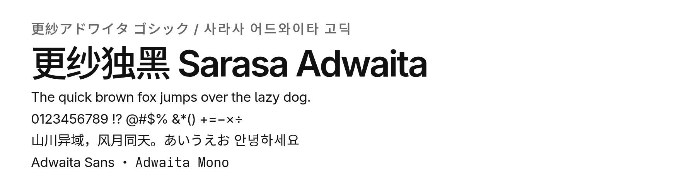
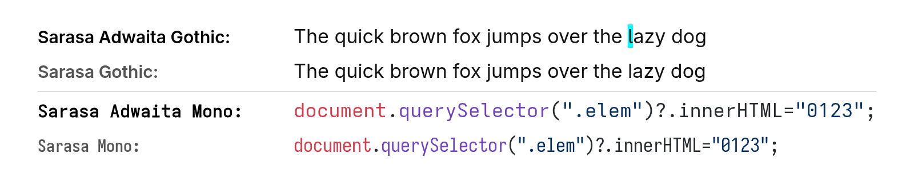
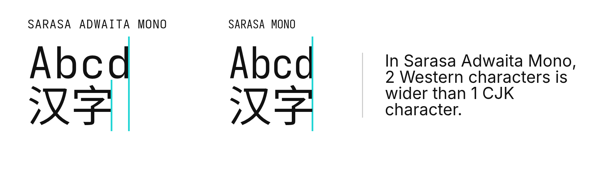

# Sarasa Adwaita（更纱独黑 / 更紗獨黑 / 更紗アドワイタ ゴシック / 사라사 어드와이타 고딕）

这是 Sarasa Adwaita，一款为了匹配 GNOME 设计系统而制作的 [Sarasa Gothic](https://github.com/be5invis/Sarasa-Gothic) 变体。

## 这是什么？

TL;DR: 将 Sarasa Gothic 原版中的 Inter/Iosevka 字体替换为 GNOME 项目定制的 Adwaita Sans/Adwaita Mono，使 Sarasa Gothic 匹配 GNOME 的设计系统。

详见下文[详细介绍](#详细介绍)。

## 注意事项

**Sarasa Adwaita Mono 不推荐在终端中使用**。原版 Sarasa Mono 使用默认参数的 Iosevka，而 Sarasa Adwaita Mono 使用 Adwaita Mono（经定制的 Iosevka）。Adwaita Mono 比默认 Iosevka 更宽，导致 Sarasa Adwaita Mono 的中英文宽度之比不是 2:1，而是约 2:1.2。原版 Sarasa Mono 在此方面表现更好，因此终端场景仍推荐使用 Sarasa Mono。

强烈建议在安装新版本字体前完全移除旧版本。许多操作系统和软件在处理大型 TTC 字体时，缓存系统可能出现问题。

## 使用方法

### 预构建 TTF/TTC 文件

从 [releases 页面](https://github.com/lingrottin/Sarasa-Adwaita/releases) 下载并安装。

> [!NOTE]
> 预构建的 Sarasa Adwaita 使用 [ttfautohint](https://freetype.org/ttfautohint/) 替代 [chlorophytum](https://github.com/chlorophytum/engine) 进行微调。这意味着 Sarasa Adwaita 在低分辨率下的显示效果可能不如 Sarasa Gothic。
> 
> 原因和替换说明详见[下文](#为什么用-ttfautohint-而不是-chlorophytum)。

### 从源码构建

> [!WARNING]
>
> 构建本字体需要相当的时间、CPU 和内存资源。参考：在 AMD Ryzen 5 7735HS 机器上约需 2.5 小时。

详见 [构建指南](/BUILDING.zh-CN.md)。

#### 为什么用 ttfautohint 而不是 chlorophytum？

TL;DR: chlorophytum 太慢了（完整构建需 300+ 小时），ttfautohint 快得多。

[Hinting（字体微调）](https://en.wikipedia.org/wiki/Font_hinting) 是一种使字体在低分辨率下显示更清晰的技术。

[Chlorophytum](https://github.com/chlorophytum/engine) 是 Iosevka 和 Sarasa Gothic 作者编写的优秀字体微调引擎。它专为 CJK 字形设计，基于 CJK 字形的内在特征进行*“意图驱动”*的分析。Sarasa Gothic 的构建管线使用此引擎来精确微调，效果也确实很好。

但它**过于**沉重和缓慢。用如此复杂的算法分析字形需要大量计算，而 Sarasa Gothic 是一个拥有 30000+ 字形、180 个版本的字体。根据我的实测，用 chlorophytum 微调 30000+ 字形在 128 核机器上需要 1.7 小时/每个字重。完整的微调阶段总计约 ***~306*** 小时（12 天 18 小时）。

相比之下，ttfautohint 是另一款微调工具。虽然它并非专为 CJK 设计（效果可能不如 chlorophytum），但微调速度快得*多*。每个字体只需不到 1 分钟，使构建时间变得可接受。

因此，Sarasa Adwaita 的构建管线默认让 Sarasa Gothic 只生成未微调的 TTF，然后自行用 ttfautohint 进行微调。

也正是因此，Sarasa Adwaita 在低分辨率下的显示效果可能不如 Sarasa Gothic。

### 字体名称说明

- 按风格
  - 拉丁/希腊/西里尔字符集为 Inter
    - 引号（" "）为全宽 —— Gothic
    - 引号（" "）为窄宽 —— UI
  - 拉丁/希腊/西里尔字符集为 Iosevka（等宽）
    - 破折号（——）为全宽 —— Mono
    - 破折号（——）为半宽 —— Term
    - 无连字，破折号（——）为半宽 —— Fixed
- 按字形
  - CL：传统字形，来自[尙古](https://github.com/GuiWonder/Shanggu)项目
  - SC/TC/HC/J/K：各区域的字形，分别用于：
    - SC（简体中文）：中国大陆
    - TC（繁体中文）：中国台湾
    - HC（香港繁体）：中国香港特别行政区
    - J（日语）：日本
    - K（朝鲜语）：韩国/朝鲜

## 详细介绍

### 背景

[Sarasa Gothic](https://github.com/be5invis/Sarasa-Gothic) 是一款将 Noto CJK 字体中的西文部分替换为 [Inter](https://rsms.me/inter) 和 [Iosevka](https://typeof.net/Iosevka/) 字形的字体。

[Adwaita 字体系列](https://gitlab.gnome.org/GNOME/adwaita-fonts)（包含 Adwaita Sans 和 Adwaita Mono）是 GNOME 项目对 Inter 和 Iosevka 的定制版本，自 GNOME 48 起作为默认字体。

虽然 Sarasa Gothic 的西文部分本质上就是 Inter 和 Iosevka（也就是 Adwaita 字体的基础），但 Sarasa Gothic 并不完全匹配 GNOME 桌面的风格。尤其是等宽变体 Sarasa Mono——其西文字形更窄、更高，带有一点"极客风"，而 Adwaita Mono 明显更宽、更温暖。

这是因为 Iosevka 是一款**高度可定制**的可变字体。为了使 Adwaita Mono 看起来像"Adwaita Sans（即 Inter）的等宽版本"，GNOME 团队在 Iosevka 上做了大量定制。而 Sarasa Gothic 使用 Iosevka 的默认参数，移除了其定制能力，直接捆绑。最终结果是，Sarasa Mono 与 Adwaita Mono 长得完全不同。

### 目标

由于 Adwaita 字体本身就是 Inter 和 Iosevka 的变体，它们应该可以无缝替换 Sarasa Gothic 构建管线中的 Inter 和 Iosevka，从而生成一款具有 GNOME 风格西文字形的定制 Sarasa Gothic。

本项目是一个自动化构建脚本，能够从 Inter/Iosevka 构建 Adwaita Sans 和 Mono，将其放入 Sarasa Gothic 的构建管线，最终从源码构建出完整的 Sarasa Gothic。

我将这款 GNOME 风格的 Sarasa Gothic 命名为 **Sarasa Adwaita**。

### 关于名称

"Adwaita" 是 GNOME 设计系统的名称。因此将本项目命名为 "Sarasa Adwaita" 是顺理成章的选择。

Adwaita 一词来自梵语，意为"独一无二的"。

本字体的中文名"更纱*独* 黑"基本是英文名的直译，其中"Adwaita"取梵语原意。

## 版权声明

*本项目与 Sarasa Gothic 作者或 GNOME 项目无任何关联、资助、认可或支持关系。*

本项目包含并衍生自下列版权持有者的作品。这些作品的版权仍归其各自的版权持有者所有。

本人不主张对本项目中的原创贡献享有版权。

所包含作品的版权声明：

- Sarasa Gothic / Iosevka — © 2014–2024 Renzhi Li
- Inter — © 2014–2024 The Inter Project Authors
- Adwaita Sans / Adwaita Mono — © 2023–2024 GNOME Foundation
- Noto Sans CJK — © Google LLC and Adobe

## 许可证

本项目生成的字体文件采用 SIL Open Font License 1.1 版授权。适用的版权声明和许可条款请参见 [LICENSE](./LICENSE)。

用于构建字体的构建脚本、配置文件及其他原创源代码均以 The Unlicense 发布到公有领域。请参见 [UNLICENSE](./UNLICENSE)。

上述许可证仅适用于所述的相应材料，不会改变本项目中所包含的任何第三方作品的版权或许可条款。

## 致谢

- [Sarasa Gothic](https://github.com/be5invis/sarasa-gothic)
- [Source Han Sans](https://github.com/adobe-fonts/source-han-sans) 或 [Noto Sans CJK](https://fonts.google.com/noto/specimen/Noto+Sans)（它们本质上是同一个东西，对吧？）
- [Iosevka](https://github.com/be5invis/Iosevka)
- [Inter](https://github.com/rsms/inter)
- [Adwaita Fonts](https://gitlab.gnome.org/GNOME/adwaita-fonts)
